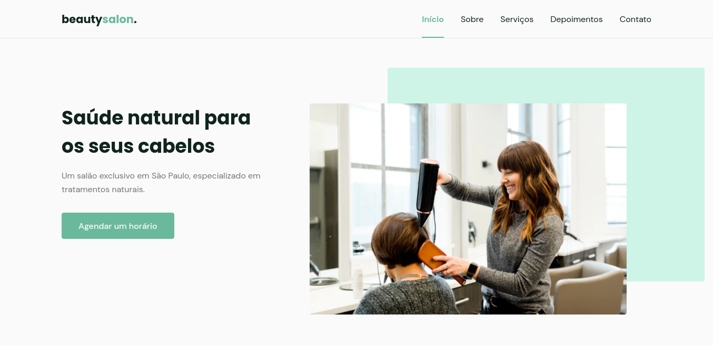

<h1 align="center">beauty salon</h1>

Projeto da NLW#6 - Mission Origin da [Rocketseat](https://github.com/Rocketseat)

Você pode ver essa página [aqui](https://lucasregisdemoraes.github.io/beauty-salon/)

---

## Tecnologias

Esse projeto foi desenvolvido com as tecnologias:

- HTML
- CSS
- JavaScript

Bibliotecas

- [Google Fonts](https://fonts.google.com/)
- [SwipeJS](https://github.com/nolimits4web/Swiper)
- [ScrollRevel](https://scrollrevealjs.org)

Utilitários

- [randomuser.me](https://randomuser.me/photos)
- [IconMoon](https://icomoon.io/app/#/select)

 ## Projeto
 
 beautysalon é uma página institucional no formato One Page, responsiva, para usar em diversos tipos de micro, pequena e média empresas. Contém as seguintes seções: Header, Navigation, Home, Sobre, Serviços, Depoimentos, Contato e Footer

## Licença

[Licença MIT](./LICENSE)
